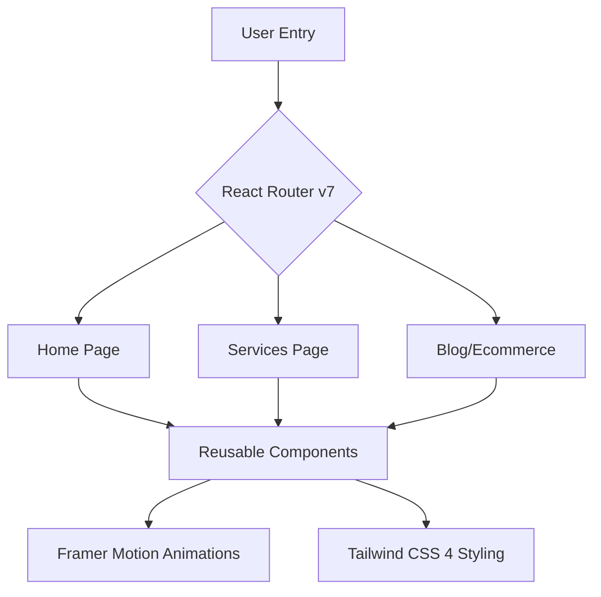

# 🌌 Nexus Digital | Ultimate Technical Documentation

> A high-performance, premium agency platform designed for high-end digital marketing and SaaS consulting.

This documentation provides an exhaustive breakdown of every feature, component, and technical implementation within the Nexus Digital ecosystem.

---

 📌 Table of Contents
- 🚀 Installation & Deployment (#1-installation--deployment-guide)
- 📁 Project Structure (#2-project-structure)
- 🏗 Architecture & Tech Stack (#3-architecture--tech-stack)
- 📄 Exhaustive Page Guide (#4-exhaustive-page-guide)
- 🧩 Component Deep-Dive (#5-component-deep-dive)
- 🎨 Design & Style System (#6-design--style-system)
- 🌐 SEO, Assets & Config (#7-seo-assets--config)
- 🔧 Maintenance & Troubleshooting (#8-maintenance--troubleshooting)
- 📈 Performance Optimization (#9-performance-optimization)

---

 🚀 1. Installation & Deployment Guide

📋 Prerequisites
| Requirement | Minimum Version |
| :--- | :--- |
| Node.js | v18.0.0+ |
| npm | v9.0.0+ |
| Browser | Modern (CSS Layering & ESModules support) |

💻 Local Setup
1.  Clone & Enter:
    ```bash
    git clone <repository-url>
    cd nexus-digital
    ```
2.  Environment Setup:
    ```bash
    cp .env.example .env
    ```
3.  Dependency Installation:
    ```bash
    npm install
    ```
4.  Execution:
    ```bash
    npm run dev
    ```

🏗 Production Lifecycle
- Build: npm run build (Generates optimized /dist folder).
- Lint: npm run lint (Checks for code quality and type safety).
- Preview: npm run preview (Locally serve the production build).

---

 📁 2. Project Structure

A high-level overview of the repository organization:

```text
nexus-digital/
├── public/                # Static assets (Favicons, Robots.txt)
├── src/
│   ├── components/        # Reusable UI modules (Navbar, Hero, Stats)
│   ├── pages/             # Route-level views (Home, Services, Blog)
│   ├── layouts/           # Page wrappers (if applicable)
│   ├── App.tsx            # Root component & Routing logic
│   ├── main.tsx           # Entry point
│   └── index.css          # Tailwind 4 & Global CSS variables
├── .env.example           # Template for environment variables
├── package.json           # Scripts & Dependencies
├── tsconfig.json          # TypeScript configuration
└── vite.config.ts         # Vite build settings
```

---

 🏗 3. Architecture & Tech Stack

The application follows a modular, component-based architecture designed for high scalability and sub-second page transitions.

📊 System Workflow


⚛️ Core Stack
- React 19: Utilizing the latest rendering optimizations.
- Vite: Ultra-fast HMR (Hot Module Replacement) and build pipeline.
- Framer Motion: Handles all complex physics-based animations and "Liquid FX".

💎 Content Decoupling (Scalability)
To ensure the project can scale into a massive platform, we have decoupled the data from the UI:
- Centralized Data: All services, testimonials, and process steps are stored in src/data/.
- Type Safety: Full TypeScript interfaces are defined in src/types/ to prevent runtime errors during content updates.
- Future Proof: This architecture allows for a seamless transition to a Headless CMS (like Sanity) in the future.
- Tailwind CSS 4: Next-gen utility engine using native CSS variables.

---

 📄 4. Exhaustive Page Guide

🏠 Home Page (Home.tsx)
The primary high-conversion landing page.
- Key Components: Hero, Stats, Services (preview), Testimonials.
- Logic: Uses a custom scroll-trigger to toggle navbar styles.
- Unique Feature: Includes a global anchor point for "Client Testimonials".

💼 Services Page (ServicesPage.tsx)
Technical breakdown of agency offerings.
- Implementation: Maps through a serviceList array to render high-fidelity cards.
- Interactions: Each card features a "Glassmorphism" hover effect with depth-sensing scale.

🛒 Ecommerce Page (Ecommerce.tsx)
Specialized vertical for high-growth shopping brands.
- Sections: Inventory Ops, Performance Marketing, CRO.
- Design: Uses higher image density to showcase product-level expertise.

✍️ Blog / Insights (Blog.tsx)
Authority-building content hub.
- Grid System: Dynamic 1-to-2 column responsive layout.
- Metadata: Tracks read-time and category filters.

📞 Contact Page (Contact.tsx)
Direct conversion funnel.
- Features: Integrated Telegram redirect, direct email link, and geographic branding.
- Mobile Opt: Phone numbers and socials use native URI schemes for instant app opening.

---

 🧩 5. Component Deep-Dive

🧭 Navbar (Navbar.tsx)
- Blur Logic: Uses backdrop-filter: blur(12px) for that premium "Apple-style" transparency.
- State Management: Tracks isScrolled (boolean) to adjust height and opacity dynamically.
- Mobile Nav: A sophisticated portal-based overlay with staggered entry animations.

📊 Stats Bar (Stats.tsx)
- Animation: Numbers utilize a "Count-Up" effect (if implemented) or simple fade-ins to draw eye-attention to social proof.
- Responsive: Shifts from horizontal row (Desktop) to vertical stack (Mobile).

---

 🎨 6. Design & Style System

📐 Typography & Spacing
- Headers: font-black (900) with tracking-tighter for that brutalist look.
- Body: leading-relaxed for maximum readability against dark backgrounds.
- Gaps: Standardized using Tailwind's spacing scale (usually gap-8 for sections).

💅 Custom Utilities (in index.css)
- Liquid Background: A custom keyframe animation for the "lava lamp" effect.
- Glassmorphism: 
  ```css
  .glass {
    background: rgba(255, 255, 255, 0.03);
    backdrop-filter: blur(10px);
    border: 1px solid rgba(255, 255, 255, 0.1);
  }
  ```

---

 🌐 7. SEO, Assets & Config

🔍 SEO & Meta Management
- Dynamic Head Tags: Implemented react-helmet-async to manage <title>, <meta>, and Open Graph tags dynamically per page.
- SEO Component: Use the src/components/SEO.tsx component on any page to set custom metadata:
  ```tsx
  <SEO title="My Page" description="Detailed description here..." />
  ```
- Social Sharing: Every page is now optimized for social media (Twitter/Facebook) with custom OG tags and image previews.
- Titles: Automatically formatted as "Page Title | Nexus Digital".

📁 Asset Management
- Images: Store high-res images in public/assets/ or import directly in src/assets/ for Vite optimization.
- Icons: Exclusively uses Lucide React. To add an icon:
  ```tsx
  import { CheckCircle } from 'lucide-react';
  ```

---

 🔧 8. Maintenance & Troubleshooting

🆘 Technical Support & Fixes
| Challenge | Solution Path |
| :-------- | :------------ |
| Styling inconsistencies | Verify that the Tailwind 4 engine is correctly imported at the top level of index.css and that npm run dev is actively watching for changes. |
| Animation performance | Reduce the blur radius in Framer Motion components (automatically optimized for mobile) or check for layout-shifting props. |
| Deployment route errors | Ensure vercel.json is present in the root with the "rewrites" rule to handle single-page application routing correctly. |

🔄 Site Content Updates
- Global Brand Name | Update strings in Navbar.tsx, Footer.tsx, and the metadata section of index.html.
- Client Feedback | Modify the testimonial array within Testimonials.tsx to add, remove, or edit client quotes.
- Service Offerings | Navigate to ServicesPage.tsx and update the data objects to reflect changes in consulting tiers.
- Project Portfolio | Update the projects list in Projects.tsx to showcase the latest high-performance agency work.

---

 📈 9. Performance Optimization

- 🌊 Page Transitions: Implemented AnimatePresence in App.tsx for seamless, liquid route changes.
- ⚓ Hash Link Handling: Optimized RootLayout to automatically detect and smoothly scroll to element IDs (like #testimonials) even when navigating from different pages.
- 🧊 Inertial Smooth Scroll: Integrated Lenis to provide a consistent, high-end "momentum" scrolling experience across all browsers (Windows, Android, iOS, macOS).
- 📱 Dynamic Viewport (dvh): Utilized 100dvh for Hero sections to prevent the "jumping" UI issue caused by mobile browser address bars.
- 🚀 Lazy Loading: Consider using React.lazy() for heavy pages like Ecommerce or Blog.
- 📱 Mobile Performance: Background blurs and backdrop filters are reduced on smaller screens to ensure 60fps on mobile GPUs.
- 🖼 Image Optimization: Always use WebP format for backgrounds to reduce payload by up to 70%.
- 📦 Bundle Analysis: Run npm run build to see asset sizes and identify heavy dependencies.

---

> [!IMPORTANT]
> Nexus Digital is designed as a template for elite performance. Avoid adding heavy third-party libraries that could compromise the 100/100 Lighthouse score potential.


